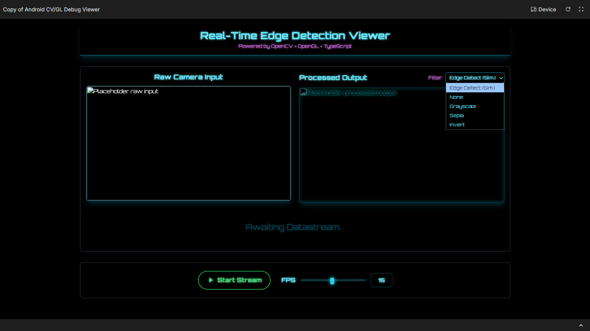
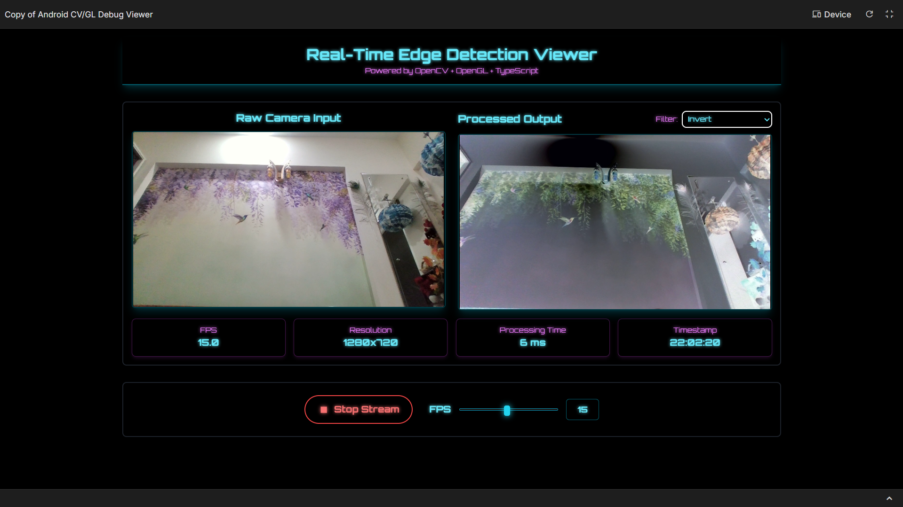
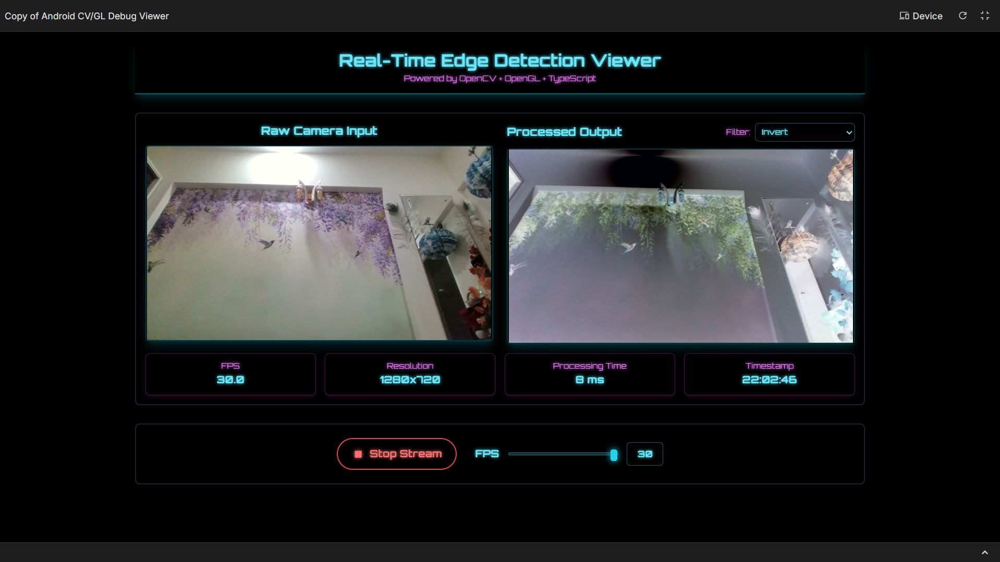

# 🌐 Android-CV-GL-Debug-Viewer-Clean  
### Real-Time Edge Detection Viewer  
> **Powered by OpenCV + OpenGL ES 2.0 + TypeScript**

---

## 📸 Project Overview  
**Android-CV-GL-Debug-Viewer-Clean** demonstrates a real-time vision pipeline integrating **Android Camera**, **C++ (OpenCV)**, and **OpenGL ES 2.0** rendering, along with a **TypeScript Web Viewer** for visualizing the processed frames.

It captures live frames from an Android device, processes them natively (e.g., grayscale, edge, invert) using **OpenCV**, and renders the processed output with **OpenGL ES** in real time (~15–30 FPS).  
The accompanying web viewer displays simulated processed frames with futuristic UI design.

---

## 🧩 Features  
- 🎥 **Live Camera Capture** using Android TextureView / SurfaceTexture  
- ⚙️ **Native Processing (JNI + C++)** with OpenCV:  
  - Grayscale  
  - Canny Edge Detection  
  - Invert / Sepia filters  
- 🧠 **OpenGL ES 2.0 Rendering** for smooth real-time display  
- 🌐 **TypeScript Web Viewer** for visualization with FPS & resolution stats  
- 🧱 **Modular Architecture:**  
  - `/app` → Android (Kotlin/Java) + Camera  
  - `/jni` → C++ + OpenCV  
  - `/gl` → OpenGL ES Renderer  
  - `/web` → TypeScript web viewer  
- 📈 Target performance: 10 – 30 FPS on mid-range devices  
- 🧩 Clean UI and dark theme with neon accents  

---

## 🖼️ Screenshots  

**1️⃣ Interface Overview (Idle State)**  
  

**2️⃣ Live Stream (Invert Filter Applied)**  
  

**3️⃣ Real-Time Edge Detection at 30 FPS**  
  

---

## 🛠️ Tech Stack  

| Layer | Technology |
|:------|:------------|
| **Frontend (Web)** | TypeScript · HTML · TailwindCSS |
| **Android** | Java/Kotlin · Camera API · JNI |
| **Native Layer** | C++ · OpenCV SDK · CMake |
| **Rendering** | OpenGL ES 2.0 (Fragment + Vertex Shaders) |
| **Version Control** | Git · GitHub |

---

## ⚙️ Getting Started  

### 🔹 Prerequisites  
- Android Studio with **NDK** and **CMake** installed  
- A device (or emulator) running Android 7.0 (API 24)+  
- Node.js (≥ 16.x) for building the web viewer  

---

### 🔹 Clone the Project  
```bash
git clone https://github.com/meghh06/Android-CV-GL-Debug-Viewer-Clean.git
cd Android-CV-GL-Debug-Viewer-Clean
